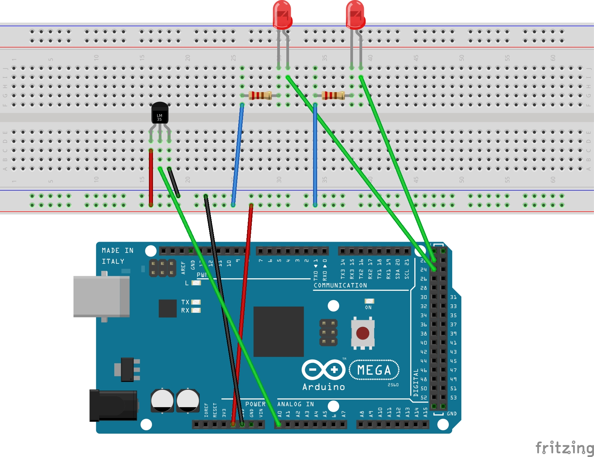
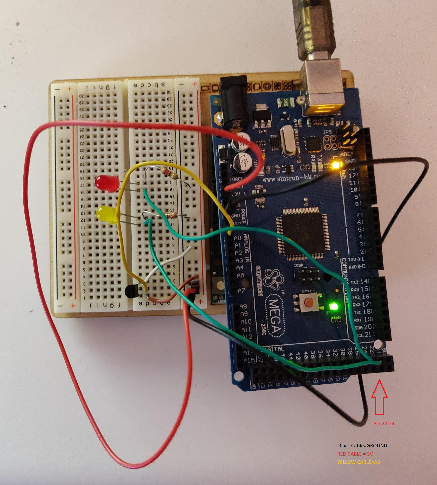

<h1>Smarthouse in AVR Arduino</h1>
<h2>Progetto sistemi operativi 2019/2020</h2>
<h3>Requisiti</h3>
<ul>
<li>1x Raspberry pi >=2 con Raspbian buster</li>
<li>1x Arduino Mega 2560</li>
<li>2x Led</li>
<li>2x Resistenze da 220 ohm</li>
<li>1x Sensore Temperatura TMP36</li>
</ul>
 
Inoltre:
<code>sudo apt-get install git arduino arduino-mk</code>
 

 
<h3>ISTRUZIONI</h3>
<ol>
<li>Montare i dispositivi come in foto</li>
<li>Collegare Arduino a Raspberry Pi via porta USB</li>
<li>Clonare la repository in Raspberry pi</li>
<li>make</li>
<li>make main.hex</li>
  <li>gcc -o NOMEESEGUIBILE client.c</li>
<li>Eseguire su terminale: 
<code>./NOMEESEGUIBILE</code>
</li>
</ol>
 
Foto del prototipo

